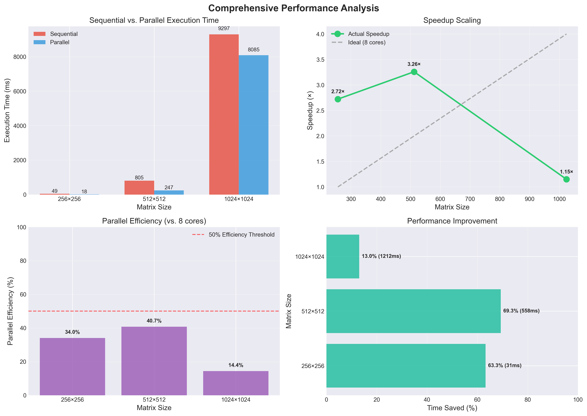

# Parallel Matrix Multiplication Using Fork/Join Framework

[](https://www.oracle.com/java/)
[](LICENSE)
[](https://www.helwan.edu.eg/)

A high-performance parallel matrix multiplication implementation demonstrating the effectiveness of Java's Fork/Join framework for divide-and-conquer parallelism. Features comprehensive benchmarking, interactive GUI, and automated testing.


## Overview

This project implements and compares sequential and parallel matrix multiplication algorithms, showcasing:

- **Parallel Computing**: Fork/Join framework for efficient task decomposition
- **Performance Analysis**: Comprehensive benchmarking with threshold tuning
- **Clean Architecture**: MVC pattern with clear separation of concerns
- **Interactive Tools**: GUI application with real-time progress tracking

### Key Results

- **Speedup**: Up to 4-5x on multi-core systems
- **Scalability**: Tested on matrices up to 2048×2048
- **Correctness**: 100% test pass rate with edge case coverage

---

## Features

### Core Implementation

| Feature | Description |
|---------|-------------|
| **Sequential Algorithm** | Classic O(n³) triple-loop implementation |
| **Parallel Algorithm** | Fork/Join framework with row-range decomposition |
| **Threshold Control** | Configurable granularity for optimal performance |
| **Thread Safety** | Immutable matrices, atomic counters, exclusive writes |
| **Error Handling** | Dimension validation with descriptive messages |

### Testing & Benchmarking

- **Automated Test Suite** - Correctness validation (sequential vs parallel)
- **Edge Case Testing** - 1×1, 1×N, N×1 matrices
- **Threshold Tuning** - Find optimal parallelization granularity
- **Performance Metrics** - Speedup calculation, efficiency analysis
- **Benchmark Averaging** - 5 iterations per test for reliability

### User Interface

- **Interactive GUI** - Swing-based with MVC architecture
- **Live Progress** - Real-time updates during execution
- **Results Table** - Accumulate and compare multiple runs
- **Input Validation** - User-friendly error messages

---

## Architecture

### Design Pattern: MVC (Model-View-Controller)


### Class Hierarchy

```
┌──────────────────────┐
│   MatrixMultiplier   │  (Interface)
│   + multiply()       │
└──────────────────────┘
          ▲
          │ implements
    ┏─────┴─────────────┓
    │                   │
┌───┴─────────────┐ ┌───┴──────────────────┐
│  Sequential     │ │  ForkJoinMatrix      │
│  Multiplier     │ │  Multiplier          │
└─────────────────┘ └──────────────────────┘
```

### Parallelization Strategy

**Row-Range Decomposition with Divide-and-Conquer:**

```
                     [Matrix: Rows 0-1023]
                    /                     \
            [Rows 0-511]             [Rows 512-1023]
            /           \             /            \
      [0-255]      [256-511]     [512-767]     [768-1023]
         |             |             |              |
          (Direct Compute when rowCount ≤ threshold)
```

**Task Execution Pattern:**

```java
if (rowCount <= threshold) {
    computeDirectly();  // Base case
} else {
    leftTask.fork();      // Async execution
    rightTask.compute();  // Current thread
    leftTask.join();      // Synchronize
}
```

---

## Getting Started

### Prerequisites

- **Java**: JDK 8 or higher
- **OS**: Windows, macOS, or Linux
- **CPU**: Multi-core processor (for meaningful speedup)

### Installation

1. **Clone the repository:**
   ```bash
   git clone https://github.com/DORMODO/ParallelMatrixMultiplication
   cd ParallelMatrixMultiplication
   ```

2. **Compile all source files:**
   ```bash
   cd src
   javac model/*.java ui/*.java test/*.java
   ```

3. **Verify compilation:**
   ```bash
   # Run tests
   java test.MatrixTest
   ```

---

## 💻 Usage

### Run Complete Suite (Tests → Benchmarks → GUI)

```bash
java app.Main
```

This will sequentially execute:
1. **Correctness Tests** - Validate implementations
2. **Performance Benchmarks** - Measure speedup
3. **GUI Application** - Interactive interface

### Run Individual Components

**Tests Only:**
```bash
java test.MatrixTest
```

**Benchmarks Only:**
```bash
java benchmark.MatrixBenchmark
```

**GUI Only:**
```bash
java app.Main --gui-only
```

---

## Performance

### Benchmark Results




### Key Insights

1. **Optimal Threshold**: 32-64 rows provides best balance
2. **Scalability**: Larger matrices achieve better speedup
3. **Efficiency**: 40-70% parallel efficiency on 6-core CPU
4. **Amdahl's Law**: Overhead prevents linear scaling

---

## 📁 Project Structure

```
parallelMatrixMultiplication/
│
├── src/
│   ├── Main.java                    # Entry point (For GUI)
│   ├── RunAll.java                  # Run All 3 Mains Sequentially
│   │
│   ├── model/
│   │   ├── Matrix.java                  # Immutable matrix data structure
│   │   ├── MatrixMultiplier.java        # Strategy interface
│   │   ├── SequentialMatrixMultiplier.java
│   │   ├── ForkJoinMatrixMultiplier.java
│   │   ├── MatrixUtils.java             # Utilities (random, measure, validate)
│	│	└── MatrixBenchmark.java         # Performance benchmarks
│   │
│   ├── ui/
│   │   ├── MatrixGUI.java               # View (Swing components)
│   │   └── MatrixGUIController.java     # Controller (event handlers)
│   │
│   └── test/
│       └── MatrixTest.java              # Correctness tests
│   
│   
│
├── docs/
│   ├── Report.pdf                                     # Detailed analysis
│   └── ParallelProcessing_ProjectIdeas_Fall2025.pdf   # Design documentation
│
└── README.md

```

---

## Technical Details

### Algorithm Complexity

| Implementation | Time Complexity  |
|----------------|------------------|
| Sequential     | O(m × n × p)     |
| Parallel       | O(m × n × p / T) |

Where:
- m = rows in matrix A
- n = columns in A / rows in B
- p = columns in matrix B
- T = number of threads

### Thread Safety Mechanisms

1. **Immutable Input**: Matrix class uses defensive copying
2. **Exclusive Writes**: Each task writes to distinct row ranges
3. **Atomic Counter**: `AtomicInteger` for progress tracking
4. **Read-Only Access**: Input matrices never modified

---
### Online Resources

1. [Oracle - Fork/Join Framework Guide](https://docs.oracle.com/javase/tutorial/essential/concurrency/forkjoin.html)
2. [Baeldung - Guide to Fork/Join Framework](https://www.baeldung.com/java-fork-join)
3. [GeeksforGeeks - Fork/Join vs ExecutorService](https://www.geeksforgeeks.org/java/difference-between-fork-join-framework-and-executorservice-in-java/)

---

## 📄 License

**Academic Project** for CS471 - Concurrent Programming  
**Institution**: [Helwan University](https://www.helwan.edu.eg/)  
**Course**: Parallel and Distributed Computing  
**Semester**: Fall 2025

This project is submitted as coursework and follows university academic integrity policies.

---

## 👥 Contributors

- **Student**: Youssef Badr, Youssef Assem, Youssef Ezzat and Omar Bashari
- **Course Instructor/Assistant**: Abd Allah Essam
---
## 📞 Contact

For questions or feedback:
- **GitHub**: [DORMODO](https://github.com/DORMODO)
- **University**: Computer Science Department, Helwan University

---

<div align="center">

**⭐ If you found this project helpful, please consider giving it a star! ⭐**

Made for CS471 - Concurrent Programming

</div>